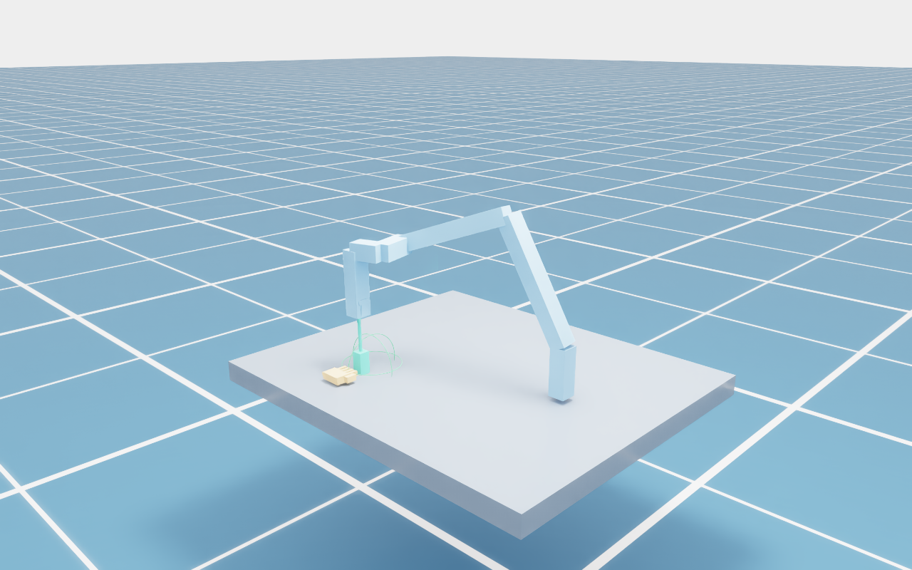
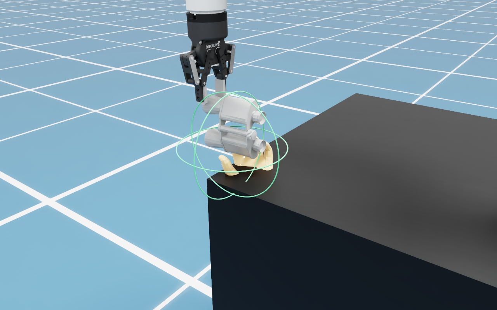

# R2HandoverSim

For original robot/object assets and visible random left/right receiving hands,
see [fixed-world receiver replay](docs/fixed_receivers.md). This workflow samples
hands before method selection and records the fixed hand pose with every trace.

**Isaac Sim handover demos with offline method outputs and reproducible result files.**

The bundled fixtures contain three objects (hammer, screwdriver, bottle) and
four illustrative joint-trajectory variants. Isaac Sim renders the scene,
advances the simulation, and queries PhysX for robot/hand overlap at each frame.
No baseline model, ROS, MoveIt, external USD asset server, or MANO download is
needed to run the examples.

The default fixtures use nominal UR5e DH kinematics with **procedural link/parallel-gripper
proxies**, an 85 mm aperture, and a fixed receiving-hand proxy. The bundled examples
replay supplied joint trajectories; an optional planner can generate new paths
for independently supplied handover targets. They do not reproduce the paper's complete
UR5e/Robotiq/MANO/MoveIt experiments or the four published baselines.

Companion method: [Intent-Handover](https://github.com/Hanxin-Zhang/intent-handover).

## Run in Isaac Sim

Tested with Isaac Sim **5.0.0**, Python **3.11**, Linux, RTX 4070. Isaac Sim must
already be installed and its license accepted by the user. In its Python
environment:

```bash
git clone https://github.com/Hanxin-Zhang/r2handoversim.git
cd r2handoversim
python -m pip install -e .
r2handoversim doctor --isaac
r2handoversim demo --object hammer --hold
```

For an Isaac Sim installation that supplies `python.sh`, from this repository:

```bash
/path/to/isaac-sim/python.sh scripts/run_isaac.py demo --object hammer --hold
```

The script resolves this repository relative to itself. There are no developer
machine paths in the runtime. Normal system Python is sufficient for the
offline `evaluate` command, but **not** for the main Isaac Sim `demo` command.

Run the complete set without a GUI:

```bash
r2handoversim demo --headless --object all --variant all \
  --render-every 6 --screenshot --animation --output outputs/isaac
```

Outputs include `report.html`, `results.json`, `results.csv`, `summary.json`, and
a final-scene `.usda` per trial. `--screenshot` adds PNGs; `--animation` adds
`*_animation.usda` files with time-sampled transforms that can be played directly
in a USD viewer. Open `report.html` to inspect metric flags and artifact links.
`--hold` keeps the GUI open after completion.

Record an MP4 directly from the Isaac Sim viewport (install `ffmpeg` on PATH):

```bash
r2handoversim demo --object hammer --headless --video --video-speed 0.25 \
  --screenshot --output outputs/recording
```

`--video` captures every replay frame, even with `--render-every` set. Videos
use H.264 at 30 fps, with one second held at the start and two at the end.
`--video-speed 0.25` slows playback to one quarter; simulation timestamps and
metrics remain unchanged. `--camera handover` frames the receiving hand closely;
the default `overview` shows the robot. `report.html` links each MP4, and
`results.json` records capture settings. Wall time includes recording overhead.
Failed capture or encoding fails the run; frame images remain for diagnosis
when encoding fails and are removed after successful encoding.

A supervisor process verifies the current run id and completion count after Kit
exits. Missing simulator dependencies, failed captures, crashes and incomplete
runs produce a nonzero CLI exit code instead of being mistaken for success.
`run.json` records the run status. Screenshot capture has a 60-second timeout.



## Local UR5e / Robotiq and object meshes

Use the original UR5e + Robotiq 2F-85 USD assembly and the 16 configured object
OBJ meshes with an explicit local asset configuration:

```bash
python -m pip install -e '.[planning,assets]'
mkdir -p outputs
cp configs/local_assets.example.json outputs/local_assets.json
# Set robot_usd and object_mesh_root in that file.
r2handoversim doctor --isaac --video --asset-config outputs/local_assets.json
r2handoversim from-assets --asset-config outputs/local_assets.json \
  --objects bottle --output outputs/local_trials
r2handoversim demo --trials outputs/local_trials/trials.json \
  --headless --video --screenshot --animation --camera handover --output outputs/asset_replay
```

Omit `--objects bottle` to generate demos for every OBJ in the configured folder.
This workflow needs no method checkout, model weights or dataset manifest. It
chooses a geometric approach, a static hand proxy and an authored 90-frame
trajectory. Its S0 metrics use object bounding boxes. Failed fits stop with an
error; outputs are replay examples, not baseline predictions. If you already
have method candidates, use [preselection asset calibration and fixed receivers](docs/fixed_receivers.md)
before selecting and converting a trial. Unprepared method selections are rejected.

The adapter uses the `danilab_ur5e` assembly's six UR5e joint names and Robotiq
finger links, including its joint-frame transforms, original meshes, materials,
and collision shapes. The example placement aligns this assembly with the
release's nominal UR5e base. Object names must match the OBJ filenames;
`object_aliases` handles `hammer` → `hammers`. Mesh vertices use meters in the
same object frame as the configured point cloud. Source paths and hashes are
recorded in results. Assets remain local and are not redistributed.

The commands above run **legacy adapted geometry demos**. For unchanged method
selections and paired fixed-hand comparisons, follow the
[fixed receiver workflow](docs/fixed_receivers.md): calibrate all candidates,
sample receiver scenes, select a method grasp, then convert and replay. That
workflow uses original-collider planning and mesh-based Reach/Affordance checks.

The original gripper tool frame is calibrated from its finger pads. Legacy demo
replay refits the supplied approach to opposing object-mesh surfaces inside the
flat pads, and inverts the actual Robotiq linkage to set the local contact gap.
The original grasp is retained in `grasp_contact`; each side must be within
0.2 mm of its USD collider surface, otherwise the replay fails explicitly.
Reports show both surface distances. This geometric contact check does not
measure frictional holding force. Authored Stability failures remain ungrasped. Playback
moves the USD links kinematically and attaches the object rigidly. PhysX Safe
checks use the USD robot colliders; Plan/Reach/Affordance retain the documented
geometric predicates. Existing proxy-tool planning metadata is not presented
as a new plan for the calibrated tool. MP4 and time-sampled USD exports use the
same joint trajectory. A decoded MANO mesh from the method pipeline is supported
with `--hand-collision mesh`.



## Resolved scenes and trajectory records

Every Isaac Sim run exports `*_trial.json` with the scene actually replayed,
including the grasp, calibrated tool offset and receiver world geometry.
Load this file directly to repeat the same scene:

```bash
r2handoversim demo --trial outputs/asset_replay/bottle_local_mesh_trial.json --headless \
  --video --animation --output outputs/reloaded
```

The resolved file embeds the object mesh and references the local robot USD.
It does not need `--asset-config` again. The adapter rechecks the original pad
contacts without refitting or moving the hand a second time. Changed mesh,
robot placement, grasp or tool calibration is rejected; regenerate from the
original input when changing assets.

`*_trajectory.npz` contains aligned `time_s`, `joint_position_rad`,
`T_world_tool`, `T_world_object`, `T_object_gripper`, and
`robot_hand_contact` arrays. Read with `numpy.load(path, allow_pickle=False)`.
For original-asset runs, tool poses are read from the USD at every frame and
checked against the replay model. These are replay observations, separate from
paper reference statistics. JSON/CSV/HTML show reference and evaluated outcomes
separately, and retain right/left pad distances.

To check a complete exported run without launching Isaac Sim again:

```bash
r2handoversim verify-output --input outputs/asset_replay
```

This checks completion counts, artifact presence, timestamps, joints, poses,
collision observations and evaluated outcomes against the resolved scene.
It does not turn replay observations into original paper measurements.

Legacy authored demos retarget the receiver during asset fitting and record that
transform. The fixed-world receiver workflow preserves the hand and object
target, calibrates all candidates before method selection, and plans with the
actual colliders. Only the latter supports unchanged receiver comparisons
across methods. Its NPZ also records `T_world_hand`, palm position, receiver ID,
side and seed; `review-video` adds matching outcome captions.

## Paper replay

```bash
r2handoversim paper-replay --output outputs/paper_replay
r2handoversim replay-trial --record S1_m4_0000 \
  --dataset /path/to/intent-handover/outputs/dataset/dataset.json --output trial.json
# Replay with the local USD/OBJ configuration above.
```

Includes 8,000 **reconstructed replay** records, four baseline settings, 16
object IDs, and S0/S1/Avg summaries matching Table I's 108 reported cells.
Records contain joint keyframes, timings, setting IDs, and reference outcomes.
The replay population and object split are documented reconstruction choices.
`reference.json` contains source settings and coverage; `verification.json`
checks the reconstructed aggregate. Simulator results are evaluated separately
and can differ from assigned reference outcomes. Real-robot tables and user
questionnaires are excluded.

## Demo variants

| Variant | Purpose |
|---|---|
| `intent_aware` | Present the free object region while leaving the intended human region available |
| `region_agnostic` | Use a candidate selected without the usage constraint |
| `execution_deviation` | Replay an unplanned deviation through the hand, demonstrating a safety failure |
| `missed_delivery` | Stop at home despite a valid plan, demonstrating a reach failure |

These are explicitly authored offline inputs, **not implementations or reported
results of FC-Handover, Handover-VA, Contact-Handover, or Intent-Handover baselines**.
The bundled S0/S1 assignment is illustrative: bottle is S0; hammer and screwdriver
are S1. It is not a recovered paper split. All sources and limitations are
recorded in the fixtures and result files.

## Metrics

| Metric | This release |
|---|---|
| Stability | Fixed-receiver assets: full object mesh projection ≤ 85 mm, separate from pad aperture; proxy fixtures retain their width rule |
| Plan | Fixed-receiver assets: full pose IK + RRT-Connect with original USD/object hull/hand triangle PhysX queries; portable proxy planner also available |
| Reach | Delivered object hull (asset workflow) or boxes intersects the palm-normal sphere (12 cm offset, 10 cm radius) |
| Affordance | Original USD fingers versus supplied usage-region boxes with assets; finger proxies otherwise; omitted in S0 |
| Safe | No hand overlap at replay frames: proxy boxes by default, original robot colliders with local assets; optional triangle-mesh hand collider |

First-failure attribution follows **Stability → Plan → Reach → Affordance → Safe**.
S0 excludes Affordance from success and reports it as null. Failure rates sum to
`1 - success_rate` within a split. Independently computed metric flags remain in
the result for diagnosis, even when an earlier criterion fails.

Stored traces retain the original lightweight Plan check. The new `plan`
command performs full-pose numerical IK and RRT-Connect, with attached-object,
hand, table/obstacle and nonadjacent arm-proxy checks. It is a portable release
implementation. Fixed-receiver mesh trials instead plan inside `demo` using
original USD colliders and PhysX. Neither implementation is MoveIt. Safety is sampled,
not continuous collision detection. Scene visuals and box queries are kinematic
replay, not an articulated torque simulation. No frictional grasp stability is
claimed. Planning time is measured for newly planned trials and remains null for stored
traces. Simulation duration and simulator wall time have separate fields. See [protocol details](docs/protocol.md).

## Offline checks and your own traces

```bash
python -m pip install -e '.[planning,assets]'
r2handoversim evaluate --object all --variant all --output outputs/offline
python -m unittest discover -s tests -v
```

The CPU evaluator uses oriented-box intersections in place of PhysX and is
useful for inspecting traces and testing installation. It is an auxiliary path;
the main demo remains Isaac Sim.

To use output from the separate `intent-handover` repository:

```bash
r2handoversim from-intent \
  --scene /path/to/intent-handover/outputs/demo/hammer_scene.json \
  --selection /path/to/intent-handover/outputs/demo/hammer_FS.json \
  --output outputs/custom_trial.json
r2handoversim demo --trial outputs/custom_trial.json --hold
```

Alternatively, edit one of `src/r2handoversim/assets/*.json` according to
[the protocol](docs/protocol.md). Both repositories install and run independently;
the integration exchanges JSON files, with no cross-repository imports.

If the method scene was produced with `from-prediction`, conversion preserves
the predicted palm normal and carries the decoded MANO mesh into Isaac Sim for
display. Add `--hand-collision mesh` to use its triangles for PhysX safety
queries. Without this flag, collision evaluation uses the skeletal box proxies.
The portable CPU planner uses boxes; the fixed-receiver workflow uses live PhysX
mesh queries and exports verifiable observations for offline checks. MANO-derived outputs remain local/generated assets
and are not bundled in the repository.

## Complete method runs and paired ablations

`from-pipeline --pipeline /path/to/pipeline.json` converts a completed neural
method run directly. `from-experiment --manifest /path/to/experiment.json`
plans FS/A1/A2/A3 with the same world-frame receiving hand and object target
for each object. Failed plans remain visible in the results.
See [commands and comparison conventions](docs/workflows.md).

## Paper details and new targets

```bash
python -m pip install -e '.[planning]'
r2handoversim plan --trial outputs/custom_trial.json --seed 0 \
  --output outputs/planned_trial.json
r2handoversim demo --trial outputs/planned_trial.json --headless --animation
```

The method's skeletal delivery target can also be supplied with the
`from-intent --delivery` option, which runs IK/planning automatically. Failed planning saves a
failed trial for diagnosis and returns a nonzero exit code.

Each report now includes `paper_table.csv` and `paper_table.json`: trial means
per object, object means per split, then equal S0/S1 Avg. S0 Affordance is null;
only its contribution to Avg is zero, following Table I's footnote. Missing
timing values remain null. See [paper-to-code mapping and commands](docs/paper_details.md).

## Run all locally configured objects

After the method imports the original dataset config:

```bash
r2handoversim from-dataset \
  --manifest /path/to/intent-handover/outputs/han_dataset/dataset.json \
  --output outputs/han_trials
r2handoversim demo --trials outputs/han_trials/trials.json --headless \
  --screenshot --render-every 12 --output outputs/han_isaac
```

The 16 available original point clouds are displayed directly and move with the
object. Geometry metrics still use explicit occupied-cell box proxies. This
batch uses generated hand/grasp examples and S0 evaluation because the config
does not supply original functional-region labels or the paper split. It is
separate from the three synthetic objects. See [dataset protocol](docs/dataset.md).

## Laboratory rendering

The default lab preset uses a neutral grey background, dark workbench and five
soft area lights. Use `--renderer pathtraced` for final media and `--camera`
`handover`, `left`, `right` or `top` for complementary views. See
[lighting and camera commands](docs/rendering.md). `--visual-style debug` restores
the original diagnostic appearance.

## Installation help and release checks

`r2handoversim doctor --isaac --video --asset-config outputs/local_assets.json`
checks dependencies, encoder availability and local mesh files before launching
Kit. Omit optional flags for an offline-only installation. It does not start the
GPU runtime; the documented `demo` smoke run verifies that separately.

See [installation and troubleshooting](docs/installation.md),
[release checklist](docs/release.md), [validation history](docs/validation.md),
and [external software and asset terms](THIRD_PARTY.md).

## Sources

- Paper/project: [R2HandoverSim](https://robot-future.github.io/r2handoversim/).
- Robot dimensions: [Universal Robots nominal DH parameters](https://www.universal-robots.com/articles/ur/application-installation/dh-parameters-for-calculations-of-kinematics-and-dynamics).
- Simulator: [NVIDIA Isaac Sim documentation](https://docs.isaacsim.omniverse.nvidia.com/5.0.0/index.html).

New release code and procedural fixtures are MIT. Isaac Sim is separately
installed under NVIDIA's terms. No NVIDIA robot USDs, original dataset meshes,
MANO models, or participant data are bundled.
