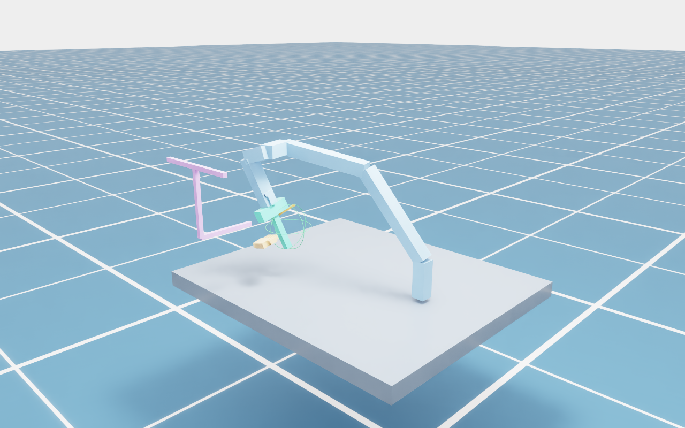

# Paper protocol and implementation map

Source: **R2HandoverSim**, supplied manuscript `IROS26_3330_FI.pdf`, Sec. III-A–E,
Eqs. (1)–(6), and Table I. Companion execution formulas come from
Intent-Handover Sec. III-B. The two papers use different delivery strategies:
the method describes skeletal ergonomics, while the benchmark's adapted
Intent-Handover baseline uses a palm-relative placement. This release exposes
the method's ergonomic target as an optional input; it does not label it as a
reproduction of the benchmark baseline's Table I run.

| Detail | Implementation | Fidelity boundary |
|---|---|---|
| Object fixed relative to end effector; no tabletop pickup | `T_object_gripper` and rigid attachment during replay | Original meshes in asset workflow; proxy fixtures also retained |
| Static receiver per trial | Seeded fixed-world left/right hand meshes, passed to method before selection | Local templates, not original 400 interaction sequences |
| Full pose numerical IK, then RRT-Connect | `planning.solve_pose`, `rrt_connect` | SciPy numerical Jacobian + portable NumPy search; not MoveIt |
| Plan, Eq. (1) | PhysX original USD/object hull/MANO triangle queries in fixed-receiver workflow | Numerical IK + RRT-Connect, not MoveIt; proxy planner also retained |
| Reach, Eq. (2) | Object intersects sphere at palm + 0.12 m normal, radius 0.10 m | Original convex hull in asset workflow; proxy union otherwise |
| Stability, Eq. (3) | Full object mesh closing-axis projection <= 0.085 m; fail before planning | Explicit operational width definition, separate from fitted pad aperture |
| Affordance, Eq. (4) | Actual USD finger/usage-region overlap; omitted in S0 | Usage regions remain supplied box approximations |
| Safe, Eq. (5) | Original USD arm/gripper colliders versus static hand triangles each frame | Kinematic replay and geometric contact; no grasp-force simulation |
| Failure attribution, Eq. (6) and following text | Stability → Plan → Reach → Affordance → Safe | All flags retained for diagnosis; first failure alone contributes to rates |
| Table I averaging | `aggregation.table_rows` | Applied to release examples, never copied paper numbers |

## Original-asset fixed receiver workflow

The table above distinguishes the portable proxy and original-asset workflows. The
[fixed-world receiver workflow](fixed_receivers.md) adds original USD collision
planning, original object hull Reach, actual finger-region queries and static
left/right hand meshes. It supersedes the proxy geometry limitations when that
workflow is used. It does not recover the paper's original sampling dataset,
MoveIt implementation or original baseline runs.

## Plan an actual target pose

```bash
python -m pip install -e '.[planning]'
r2handoversim plan --trial outputs/custom_trial.json --seed 0 \
  --output outputs/planned_trial.json
r2handoversim demo --trial outputs/planned_trial.json --headless \
  --screenshot --animation --output outputs/planned_replay
```

Alternatively, supply the companion method's `handover.delivery.v1` JSON via
`from-intent --delivery ...`; it constructs the fixed receiving scene from the
target and runs planning. The initial robot configuration stays at home. The
input world frame must match the simulator's world frame; this release's robot
base is at `[0, 0, 0.75]` m. A world-to-robot transform in the method output is
diagnostic and does not replace simulator base calibration.

IK uses six-dimensional position/rotation error, eight deterministic seeded
initial guesses and ±2π joint bounds. Accepted solutions are within 1 mm and
0.005 rad of the target. RRT-Connect checks the direct edge first and searches
two trees if blocked. Defaults: 600 expansions per IK solution, 0.25 rad
Euclidean extension step, at most 0.06 rad per joint between edge checks.
The output is linearly resampled at the trial timestep, capped at 0.6 rad/s per
joint. There are no acceleration or torque constraints.

Planning checks the robot and attached object against hand/obstacle boxes, and
nonadjacent robot proxies against each other. A default table is included.
`obstacle_boxes_world` can explicitly override the obstacle list. To avoid false
self contacts inherent to proxy construction, links within two hops and held
object/gripper contacts with distal wrist/tool links are excluded. This is not
a full URDF allowed-collision matrix. The evaluator rechecks generated paths;
it does not accept a successful planner status as proof by itself.

Failure saves a trial with `planning.status=failed`, its reason and measured
planning time, leaves execution at home, and returns CLI exit code 2. Evaluating
that record yields a Plan failure unless an earlier Stability check fails.
Absence of an IK solution or failure within the search budget is an observed
planning failure, not proof that no feasible path exists.



## Use the static hand triangles for Safe

For a trial converted from a decoded MANO scene:

```bash
r2handoversim demo --trial outputs/neural_trial.json --headless \
  --hand-collision mesh --screenshot --output outputs/mesh_replay
```

This requires `hand_mesh_world`. Isaac Sim applies a static triangle-mesh
collider, disables the hand-box colliders, and queries robot-box overlap against
the mesh at every replay frame. The result records `hand_collision` and
`safe_source`. Missing meshes are an error, not a silent fallback. The CPU
planner and offline evaluator still use hand boxes. The mesh is not secretly
used for Plan. MANO files and generated meshes remain local, unbundled assets.

## Table I and timing

Every evaluation writes `paper_table.csv` and `paper_table.json`, grouped by
variant (the release examples are not implementations of the four baselines):

1. Compute trial means for each object/variant/split.
2. Average object means with equal object weight within each split.
3. If both splits exist, average S0 and S1 equally for Avg, regardless of their
   object/trial counts.
4. S0 Fafford is null. Only for Avg, count its contribution as zero, exactly as
   Table I's footnote specifies. First-failure rates sum to `100 - SR`.

Rates are percentages; times are seconds. `Tplan` is measured numerical IK and
search time for new plans. `Texec` uses simulated trajectory duration, not
renderer speed; simulator execution wall time is retained separately. `Ttot`
is `Tplan + Texec` only where both exist. If any trial needed for a time average
has no measurement, that aggregate is null. No successful-trials-only timing
filter is applied. The manuscript does not specify its clock implementation,
so these clock choices are explicit release conventions, not numerical parity.

`summary.json` retains pooled trial-weighted summaries for backward compatibility;
it can differ from `paper_table.json` when object trial counts differ.

Still absent: the original 400 curated interactions, exact top-100
Multi-GraspLLM subset/ranking, original semantic masks, MoveIt backend, original
baseline models, hardware trials and participant ratings. The local 16 original
object meshes and original USD robot geometry are now connected in the asset
workflow; the three procedural objects remain separate installation examples.

## Local data now connected (0.4.0)

The original han config's 16 available object point clouds and neural input
cache can now be imported directly. This restores those local object inputs;
original triangle meshes, grasp/region annotations and split labels remain
unavailable in that config. See [dataset import and provenance](dataset.md).
